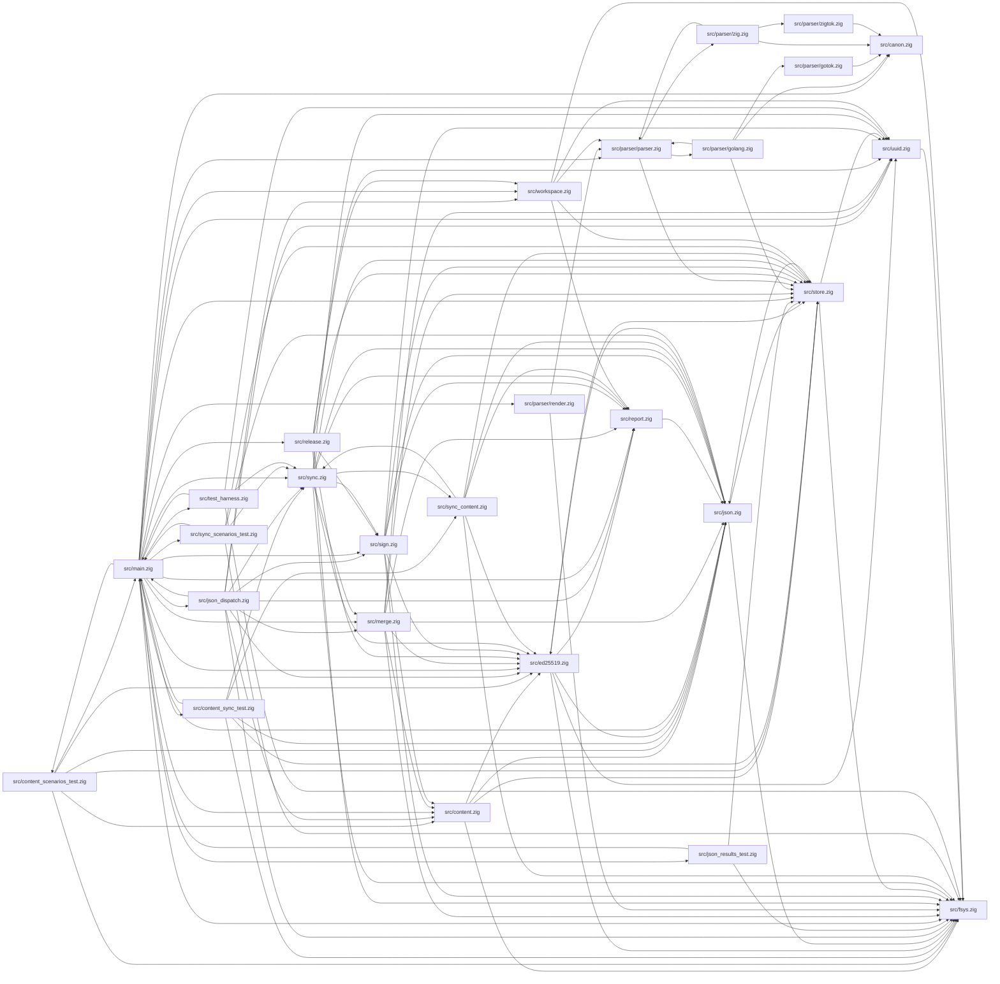

# Module map

Generated by `python3 tools/quality.py --write-docs`. Do not edit by hand.

Edges are literal Zig imports; standard-library imports are omitted.

```mermaid
flowchart LR
  src_content_zig["src/content.zig"] --> src_ed25519_zig["src/ed25519.zig"]
  src_content_zig["src/content.zig"] --> src_fsys_zig["src/fsys.zig"]
  src_content_zig["src/content.zig"] --> src_json_zig["src/json.zig"]
  src_content_zig["src/content.zig"] --> src_store_zig["src/store.zig"]
  src_content_scenarios_test_zig["src/content_scenarios_test.zig"] --> src_content_zig["src/content.zig"]
  src_content_scenarios_test_zig["src/content_scenarios_test.zig"] --> src_ed25519_zig["src/ed25519.zig"]
  src_content_scenarios_test_zig["src/content_scenarios_test.zig"] --> src_fsys_zig["src/fsys.zig"]
  src_content_scenarios_test_zig["src/content_scenarios_test.zig"] --> src_json_zig["src/json.zig"]
  src_content_scenarios_test_zig["src/content_scenarios_test.zig"] --> src_main_zig["src/main.zig"]
  src_content_scenarios_test_zig["src/content_scenarios_test.zig"] --> src_store_zig["src/store.zig"]
  src_content_sync_test_zig["src/content_sync_test.zig"] --> src_fsys_zig["src/fsys.zig"]
  src_content_sync_test_zig["src/content_sync_test.zig"] --> src_json_zig["src/json.zig"]
  src_content_sync_test_zig["src/content_sync_test.zig"] --> src_main_zig["src/main.zig"]
  src_content_sync_test_zig["src/content_sync_test.zig"] --> src_store_zig["src/store.zig"]
  src_content_sync_test_zig["src/content_sync_test.zig"] --> src_sync_zig["src/sync.zig"]
  src_content_sync_test_zig["src/content_sync_test.zig"] --> src_sync_content_zig["src/sync_content.zig"]
  src_ed25519_zig["src/ed25519.zig"] --> src_fsys_zig["src/fsys.zig"]
  src_ed25519_zig["src/ed25519.zig"] --> src_json_zig["src/json.zig"]
  src_ed25519_zig["src/ed25519.zig"] --> src_report_zig["src/report.zig"]
  src_ed25519_zig["src/ed25519.zig"] --> src_store_zig["src/store.zig"]
  src_ed25519_zig["src/ed25519.zig"] --> src_uuid_zig["src/uuid.zig"]
  src_json_zig["src/json.zig"] --> src_ed25519_zig["src/ed25519.zig"]
  src_json_zig["src/json.zig"] --> src_fsys_zig["src/fsys.zig"]
  src_json_zig["src/json.zig"] --> src_store_zig["src/store.zig"]
  src_json_dispatch_zig["src/json_dispatch.zig"] --> src_content_zig["src/content.zig"]
  src_json_dispatch_zig["src/json_dispatch.zig"] --> src_ed25519_zig["src/ed25519.zig"]
  src_json_dispatch_zig["src/json_dispatch.zig"] --> src_fsys_zig["src/fsys.zig"]
  src_json_dispatch_zig["src/json_dispatch.zig"] --> src_main_zig["src/main.zig"]
  src_json_dispatch_zig["src/json_dispatch.zig"] --> src_merge_zig["src/merge.zig"]
  src_json_dispatch_zig["src/json_dispatch.zig"] --> src_report_zig["src/report.zig"]
  src_json_dispatch_zig["src/json_dispatch.zig"] --> src_sign_zig["src/sign.zig"]
  src_json_dispatch_zig["src/json_dispatch.zig"] --> src_sync_zig["src/sync.zig"]
  src_json_dispatch_zig["src/json_dispatch.zig"] --> src_uuid_zig["src/uuid.zig"]
  src_json_dispatch_zig["src/json_dispatch.zig"] --> src_workspace_zig["src/workspace.zig"]
  src_json_results_test_zig["src/json_results_test.zig"] --> src_fsys_zig["src/fsys.zig"]
  src_json_results_test_zig["src/json_results_test.zig"] --> src_main_zig["src/main.zig"]
  src_json_results_test_zig["src/json_results_test.zig"] --> src_store_zig["src/store.zig"]
  src_main_zig["src/main.zig"] --> src_canon_zig["src/canon.zig"]
  src_main_zig["src/main.zig"] --> src_content_zig["src/content.zig"]
  src_main_zig["src/main.zig"] --> src_content_scenarios_test_zig["src/content_scenarios_test.zig"]
  src_main_zig["src/main.zig"] --> src_content_sync_test_zig["src/content_sync_test.zig"]
  src_main_zig["src/main.zig"] --> src_ed25519_zig["src/ed25519.zig"]
  src_main_zig["src/main.zig"] --> src_fsys_zig["src/fsys.zig"]
  src_main_zig["src/main.zig"] --> src_json_zig["src/json.zig"]
  src_main_zig["src/main.zig"] --> src_json_dispatch_zig["src/json_dispatch.zig"]
  src_main_zig["src/main.zig"] --> src_json_results_test_zig["src/json_results_test.zig"]
  src_main_zig["src/main.zig"] --> src_merge_zig["src/merge.zig"]
  src_main_zig["src/main.zig"] --> src_parser_parser_zig["src/parser/parser.zig"]
  src_main_zig["src/main.zig"] --> src_parser_render_zig["src/parser/render.zig"]
  src_main_zig["src/main.zig"] --> src_release_zig["src/release.zig"]
  src_main_zig["src/main.zig"] --> src_report_zig["src/report.zig"]
  src_main_zig["src/main.zig"] --> src_sign_zig["src/sign.zig"]
  src_main_zig["src/main.zig"] --> src_store_zig["src/store.zig"]
  src_main_zig["src/main.zig"] --> src_sync_zig["src/sync.zig"]
  src_main_zig["src/main.zig"] --> src_sync_scenarios_test_zig["src/sync_scenarios_test.zig"]
  src_main_zig["src/main.zig"] --> src_test_harness_zig["src/test_harness.zig"]
  src_main_zig["src/main.zig"] --> src_uuid_zig["src/uuid.zig"]
  src_main_zig["src/main.zig"] --> src_workspace_zig["src/workspace.zig"]
  src_merge_zig["src/merge.zig"] --> src_content_zig["src/content.zig"]
  src_merge_zig["src/merge.zig"] --> src_ed25519_zig["src/ed25519.zig"]
  src_merge_zig["src/merge.zig"] --> src_fsys_zig["src/fsys.zig"]
  src_merge_zig["src/merge.zig"] --> src_json_zig["src/json.zig"]
  src_merge_zig["src/merge.zig"] --> src_report_zig["src/report.zig"]
  src_merge_zig["src/merge.zig"] --> src_store_zig["src/store.zig"]
  src_merge_zig["src/merge.zig"] --> src_uuid_zig["src/uuid.zig"]
  src_parser_golang_zig["src/parser/golang.zig"] --> src_canon_zig["src/canon.zig"]
  src_parser_golang_zig["src/parser/golang.zig"] --> src_parser_gotok_zig["src/parser/gotok.zig"]
  src_parser_golang_zig["src/parser/golang.zig"] --> src_parser_parser_zig["src/parser/parser.zig"]
  src_parser_golang_zig["src/parser/golang.zig"] --> src_store_zig["src/store.zig"]
  src_parser_gotok_zig["src/parser/gotok.zig"] --> src_canon_zig["src/canon.zig"]
  src_parser_parser_zig["src/parser/parser.zig"] --> src_parser_golang_zig["src/parser/golang.zig"]
  src_parser_parser_zig["src/parser/parser.zig"] --> src_parser_zig_zig["src/parser/zig.zig"]
  src_parser_parser_zig["src/parser/parser.zig"] --> src_store_zig["src/store.zig"]
  src_parser_render_zig["src/parser/render.zig"] --> src_fsys_zig["src/fsys.zig"]
  src_parser_render_zig["src/parser/render.zig"] --> src_parser_parser_zig["src/parser/parser.zig"]
  src_parser_zig_zig["src/parser/zig.zig"] --> src_canon_zig["src/canon.zig"]
  src_parser_zig_zig["src/parser/zig.zig"] --> src_parser_parser_zig["src/parser/parser.zig"]
  src_parser_zig_zig["src/parser/zig.zig"] --> src_parser_zigtok_zig["src/parser/zigtok.zig"]
  src_parser_zigtok_zig["src/parser/zigtok.zig"] --> src_canon_zig["src/canon.zig"]
  src_release_zig["src/release.zig"] --> src_ed25519_zig["src/ed25519.zig"]
  src_release_zig["src/release.zig"] --> src_fsys_zig["src/fsys.zig"]
  src_release_zig["src/release.zig"] --> src_sign_zig["src/sign.zig"]
  src_release_zig["src/release.zig"] --> src_store_zig["src/store.zig"]
  src_release_zig["src/release.zig"] --> src_uuid_zig["src/uuid.zig"]
  src_release_zig["src/release.zig"] --> src_workspace_zig["src/workspace.zig"]
  src_report_zig["src/report.zig"] --> src_json_zig["src/json.zig"]
  src_sign_zig["src/sign.zig"] --> src_content_zig["src/content.zig"]
  src_sign_zig["src/sign.zig"] --> src_ed25519_zig["src/ed25519.zig"]
  src_sign_zig["src/sign.zig"] --> src_fsys_zig["src/fsys.zig"]
  src_sign_zig["src/sign.zig"] --> src_json_zig["src/json.zig"]
  src_sign_zig["src/sign.zig"] --> src_report_zig["src/report.zig"]
  src_sign_zig["src/sign.zig"] --> src_store_zig["src/store.zig"]
  src_sign_zig["src/sign.zig"] --> src_uuid_zig["src/uuid.zig"]
  src_store_zig["src/store.zig"] --> src_fsys_zig["src/fsys.zig"]
  src_store_zig["src/store.zig"] --> src_json_zig["src/json.zig"]
  src_store_zig["src/store.zig"] --> src_uuid_zig["src/uuid.zig"]
  src_sync_zig["src/sync.zig"] --> src_ed25519_zig["src/ed25519.zig"]
  src_sync_zig["src/sync.zig"] --> src_fsys_zig["src/fsys.zig"]
  src_sync_zig["src/sync.zig"] --> src_json_zig["src/json.zig"]
  src_sync_zig["src/sync.zig"] --> src_merge_zig["src/merge.zig"]
  src_sync_zig["src/sync.zig"] --> src_report_zig["src/report.zig"]
  src_sync_zig["src/sync.zig"] --> src_sign_zig["src/sign.zig"]
  src_sync_zig["src/sync.zig"] --> src_store_zig["src/store.zig"]
  src_sync_zig["src/sync.zig"] --> src_sync_content_zig["src/sync_content.zig"]
  src_sync_zig["src/sync.zig"] --> src_uuid_zig["src/uuid.zig"]
  src_sync_content_zig["src/sync_content.zig"] --> src_ed25519_zig["src/ed25519.zig"]
  src_sync_content_zig["src/sync_content.zig"] --> src_fsys_zig["src/fsys.zig"]
  src_sync_content_zig["src/sync_content.zig"] --> src_json_zig["src/json.zig"]
  src_sync_content_zig["src/sync_content.zig"] --> src_report_zig["src/report.zig"]
  src_sync_content_zig["src/sync_content.zig"] --> src_store_zig["src/store.zig"]
  src_sync_content_zig["src/sync_content.zig"] --> src_sync_zig["src/sync.zig"]
  src_sync_scenarios_test_zig["src/sync_scenarios_test.zig"] --> src_fsys_zig["src/fsys.zig"]
  src_sync_scenarios_test_zig["src/sync_scenarios_test.zig"] --> src_json_zig["src/json.zig"]
  src_sync_scenarios_test_zig["src/sync_scenarios_test.zig"] --> src_main_zig["src/main.zig"]
  src_sync_scenarios_test_zig["src/sync_scenarios_test.zig"] --> src_store_zig["src/store.zig"]
  src_sync_scenarios_test_zig["src/sync_scenarios_test.zig"] --> src_sync_zig["src/sync.zig"]
  src_test_harness_zig["src/test_harness.zig"] --> src_fsys_zig["src/fsys.zig"]
  src_test_harness_zig["src/test_harness.zig"] --> src_main_zig["src/main.zig"]
  src_test_harness_zig["src/test_harness.zig"] --> src_sync_zig["src/sync.zig"]
  src_test_harness_zig["src/test_harness.zig"] --> src_uuid_zig["src/uuid.zig"]
  src_uuid_zig["src/uuid.zig"] --> src_fsys_zig["src/fsys.zig"]
  src_workspace_zig["src/workspace.zig"] --> src_fsys_zig["src/fsys.zig"]
  src_workspace_zig["src/workspace.zig"] --> src_parser_parser_zig["src/parser/parser.zig"]
  src_workspace_zig["src/workspace.zig"] --> src_report_zig["src/report.zig"]
  src_workspace_zig["src/workspace.zig"] --> src_store_zig["src/store.zig"]
  src_workspace_zig["src/workspace.zig"] --> src_uuid_zig["src/uuid.zig"]
```
